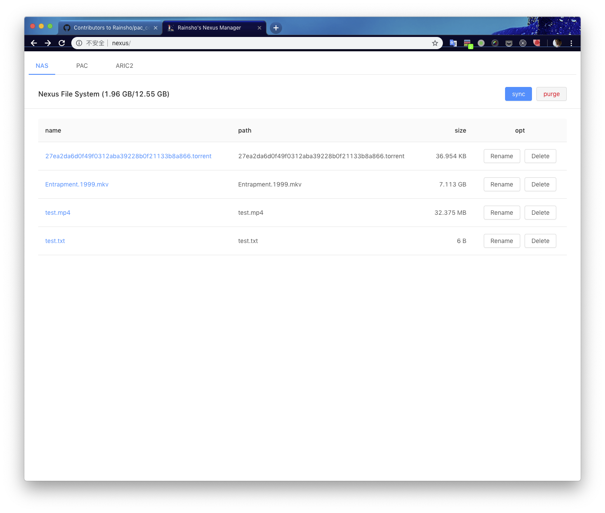

A Node.js practice demo for updating the PROXY configuration on Intranet Server.

Which is useful when others borrow my Nexus device and connet to an DHCP enabled router.

## 转发过程：

VPS: Internet --> ss-server(socks5) --> kcp-server(udp) -->  
Intranet: kcp-client(udp) --> ss-local(socks5) --> polipo(http) --> pac --> LAN

多台 VPS 使用相同的 kcp 配置(端口及加密方式)，Intranet 设备仅更新 kcp 配置内的对应 IP 即可。

## 前台 API

`update()` 依据 Intranet 设备 IP 更新 pac 配置文件内 PROXY 指向的内网 IP。

`changeHost()` 切换 Intranet 设备 kcp 配置文件内对应服务器 IP 并重启 kcp 服务，当前规则下
仅在默认服务器的 ping 值大于 ping 值最低的服务器 30% 时启用按钮。服务器端校验 IP 是否合法以及
传入的默认服务器 IP 是否与原设置相同。

## 使用 React 重构前天页面

