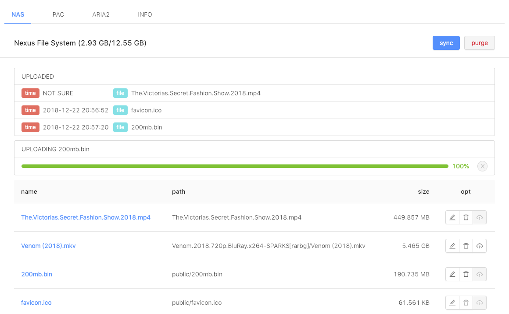
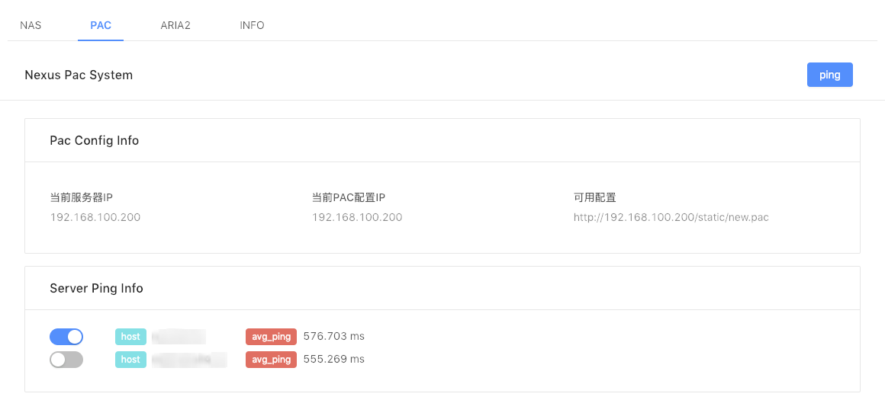
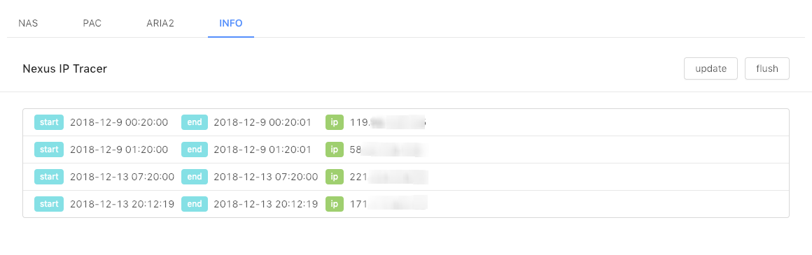

# Rainsho's Nexus Manager

I hava an old Nexus 5 running [maruos](https://maruos.com/#/), which has a simple Debian Linux System. This project is running on the Nexus device.

At first it's just a http-proxy server, as time went by I engaged nas and schedule modules in it. And using React to refactor the frount-end. So right now, it just looks like this:

## NAS

- 简单 io (配合 nginx)
- 使用 FTP 客户端上传至远端服务器
- 使用 socket.io 广播上传进度
- 使用队列保存任务信息及取消上传功能支持

## PAC

> 转发过程  
> VPS: Internet → ss-server(socks5) → kcp-server(udp) →  
> Intranet: kcp-client(udp) → ss-local(socks5) → polipo(http) → pac → LAN

外网部分设置省略，内网部分：

- 动态更新 kcp-client 配置并转发到指定端口 1
- ss-local 监听设备上指定端口 1，并转发至指定端口 2
- polipo 监听指定端口 2，并转发至指定端口 3
- 从 pac 模版文件，动态更新内网 IP 和指定端口 3 生成 pac 文件，并通过 nginx 暴露
- 内网设备通过设置使用上方暴露 pac 文件实现自动代理

## ARIA2

集成 aria2 功能加 [webui](https://github.com/ziahamza/webui-aria2)

## INFO

定时任务相关部分，目前仅用来记录内网 IP 波动情况。相关内容参考 [schedules](./schedules) 。

## CHANGELOG

just have fun~
